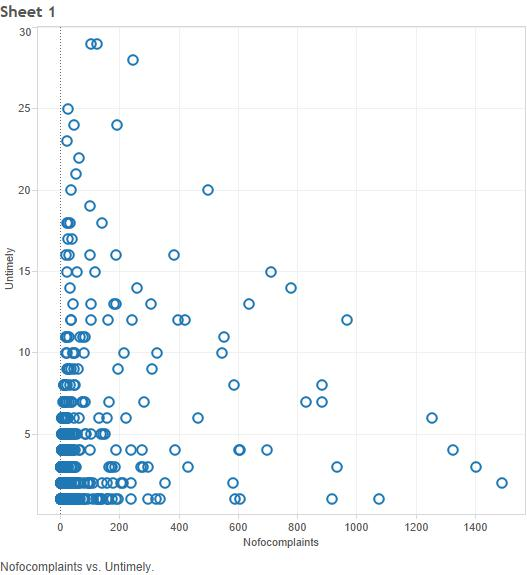

Financial Complaints Presentation
====
##What is the Consumer Complaint Database?

The Consumer Complaint Database is a collection of complaints submitted by customers of financial institutions, mainly banks. The database was created by the [Consumer Financial Protection Bureau](http://www.consumerfinance.gov/) (CFPB) in 2010 after the Dodd-Frank Act mandated that financial customers be protected against malice by financial companies by the CFPB. There are over 300,000 rows in the database. 

https://catalog.data.gov/dataset/consumer-complaint-database

Included in the data are the COMPLAINTID of each instance of a customer complaining, PRODUCT and SUBPRODUCT that the customer is complaining about, ISSUE and SUBISSUE, STATE the complaint originated from, ZIPCODE the complaint originated from, by what medium the complaint was SUBMITTEDVIA, DATERECEIVED by the CFPB and DATESENT of the company response, COMPANY being complained about, COMPANYRESPONSE provided by the company, whether it was TIMELY or DISPUTEd. The complaints are connected via ZIPCODE and STATE to additional income, mortgage, and population tables. 

Most important to the CFPB are whether or not the company's responses to the complaints are disputed by a customer or the response was untimely because these would be indications of not following the standards for customer satisfaction that the CFPB tries to uphold with the Consumer Complaint Database.

##Findings
Throughout investigation of the data it became clear very early on how much mortgage complaints dominate the database. Mortgage complaints make up 41% of the total complaints, the rest is split between debt collection, credit reporting, bank account or service, credit card, consumer loan, student loan, money transfers, and payday loan. This is likely due to how many people need a mortgage because it's related to a necessary financial investment, a home.

Another overarching trend is the tendency for companies to close complaints without relief (Monetary or non-monetary relief) and offer only an explanation to the customer to solve the problem and tell why no relief was given. The graph above shows that the percent of complaints that are closed only with explanation is increasing over time, meaning the mistakes are less and less often the company's fault and more often customer misunderstanding. Only roughly 10% of all mortgage complaints receive relief. 

##Analysis

###Geographical Overview

Even when dividing the number of complaints by the population of each zipcode, most of the large amounts of complaints come from highly populated areas (East Coast Megalopolis, Florida, Texas Cities, Chicago, and Los Angeles/San Diego). One surprising aspect is how many complaints originate from Florida, especially along the coast. 

###Number of Untimely Response Anomaly

A curious aspect showed itself in our data during analysis: companies that have fewer complaints filed against them overall tend to have more untimely responses to complaints filed against them. This is counterintuitive because one would expect the companies with fewer complaints filed against them could manage the fewer number of complaints and respond to them in a reasonable timeframe and the companies with more complaints would get bogged down and not get through all of them in time. 

###Dispute and Relief Relationship

The organization of the database changed one year after it began resulting in inconsistent categorical responses in some fields, so we remove complaints before the switch in 2012 so that the data are all compatible. This is alright to do because the vast majority of the complaints are from after 2012 anyway.

In the course of our investigation we discovered that the date sent, date received, and submittedvia fields were in regards to the submission of the complaint and have nothing to do with the companies which we were interested in so we removed these columns so they wouldn't affect any of our data mining algorithms. 

We wish to include income, population, and mortgage data for each of the zipcodes for each complaint so they are each joined with ComplainData by zipcode.

We are interested in investigating Mortgage complaints on their own as they seem most interesting and complaints can vary a lot depending on the product they are about. 

The joins resulted in some extra columns that we exclude so that they do not influence the data mining algorithms. 

Here, we run the processed data through a Classification based on Timely, a Classification based on Disputed, Anomaly detection with results written out to a new table, and clustering. 

The classification node reveals that the best predictor for a complaint that does NOT have a disputed response is the company response being 'Closed with monetary relief'. This means that if a company doesn't want to have their responses disputed, they can assume that closing the complaint with monetary (usually around $100) relief is a good way to prevent disputes. Companies benefit from having fewer disputed responses (The CFPB watches over the companies and does not like to see disputed responses) but due to the increase in 'Closed with explanation' cases rather than 'Closed with monetary relief', we can conclude that the companies are not using money to prevent disputes from occuring against them. In short, more monetary relief means less disputes. 

In the above graphs you can see that companies with many cases of providing relief (Monetary or non-monetary) such as Bank of America in the first graph have correspondingly few occurrences of disputed responses in the second graph.

After exporting the ComplainData table with an extra column for the probability that that case is anomalous provided by the anomaly detection and apply nodes, we imported that table into Tableau and examined the most likely to be anomalous cases with a slider to choose the threshold. At the higher levels, Nationstar cases showed up exclusively for a while until some Ocwen cases started appearing. This struck me as strange right away as there are many cases showing up at the high probability of being anomalous but none of them were the big banks such as Bank of America, JPMorgan, and Citi that you would expect to see everywhere well before Nationstar or Ocwen.

Upon further investigation, you can see that while most companies provide more relief and get less disputes, Nationstar and Ocwen are providing less relief and getting disputed very often. In such circumstances, Nationstar and Ocwen should be advised to provide relief more often less they risk being punished by the CFPB for not providing customers adequate support. It is the fact that Nationstar and Ocwen operate in a backwards manner in regards to the Dispute/Relief relationship as compared to other companies that they are the most anomalous points. 

