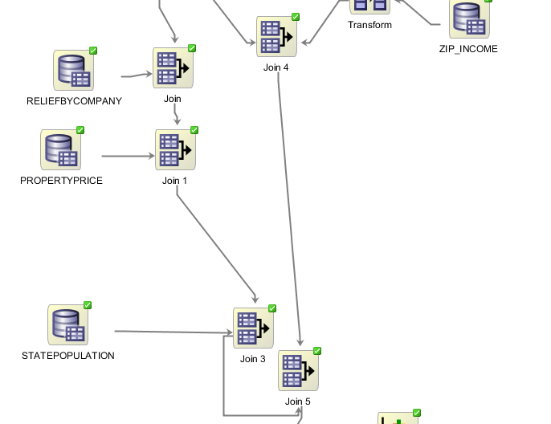
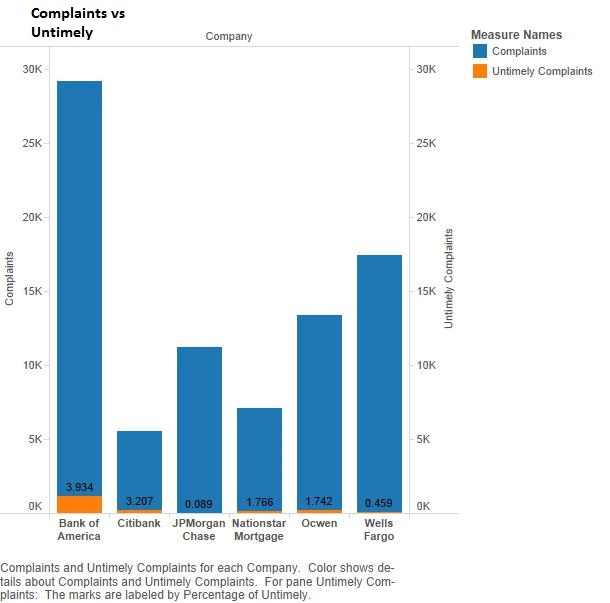

Financial Complaints Presentation
====
##What is the Consumer Complaint Database?

The Consumer Complaint Database is a collection of complaints submitted by customers of financial institutions, mainly banks. The database was created by the [Consumer Financial Protection Bureau](http://www.consumerfinance.gov/) (CFPB) in 2010 after the Dodd-Frank Act mandated that financial customers be protected against malice by financial companies by the CFPB. There are over 300,000 rows in the database. 

https://catalog.data.gov/dataset/consumer-complaint-database

Included in the data are the COMPLAINTID of each instance of a customer complaining, PRODUCT and SUBPRODUCT that the customer is complaining about, ISSUE and SUBISSUE, STATE the complaint originated from, ZIPCODE the complaint originated from, by what medium the complaint was SUBMITTEDVIA, DATERECEIVED by the CFPB and DATESENT of the company response, COMPANY being complained about, COMPANYRESPONSE provided by the company, whether it was TIMELY or DISPUTEd. The complaints are connected via ZIPCODE and STATE to additional income, mortgage, and population tables. 

Most important to the CFPB are whether or not the company's responses to the complaints are disputed by a customer or the response was untimely because these would be indications of not following the standards for customer satisfaction that the CFPB tries to uphold with the Consumer Complaint Database.

##Findings

Throughout investigation of the data it became clear very early on how much mortgage complaints dominate the database. Mortgage complaints make up 41% of the total complaints, the rest is split between debt collection, credit reporting, bank account or service, credit card, consumer loan, student loan, money transfers, and payday loan. This is likely due to how many people need a mortgage because it's related to a necessary financial investment, a home.

Another overarching trend is the tendency for companies to close complaints without relief (Monetary or non-monetary relief) and offer only an explanation to the customer to solve the problem and tell why no relief was given. The graph above shows that the percent of complaints that are closed only with explanation is increasing over time, meaning the mistakes are less and less often the company's fault and more often customer misunderstanding. Only roughly 10% of all mortgage complaints receive relief. 

The above graph shows the 6 companies that received the most amount of mortgage-related complaints and the percentage of complaints those companies provided relief to. The average across all companies was about 10%. Chase, Citibank, and Wells Fargo offered relief at around that same rate. Bank of America, however, offered relief to 18% of mortgage-related complaints, which was almost double the average. Nationstar and Ocwen, both of which are mortgage service companies and not full-service banks, offered the least relief at about 2-3%.

The above graph shows the percentage of relief received for various mortgage-related complaints broken down by issue. There are 6 types of issues:

*Application, originator, and mortgage broker

*Credit decision/Underwriting

*Loan modification, collection, foreclosure

*Loan servicing, payments, escrow account

*Settlement process and costs

*Other

All of these issues received relief at roughly 10%, which was average.

##Analysis

###Mortgage Issues Overview

This shows the relief percentage by issue for each of the 6 main mortgage companies. Bank of America was pretty much uniformly at or above 15% relief for all 6 issues. Chase, Citi, and Wells Fargo usually offered 10% relief or greater except in the case of “Loan modification, collection, and foreclosure” complaints. This also turned out to be one of the most frequent complaints, so as a result, it dragged down the overall relief percentage for those 3 banks. 

Exploring why Bank of America offered similarly high relief for all their issues and why the other 3 banks offered such low relief for “Loan modification…” in particular would be an interesting subject for further research. 

Ocwen and Nationstar offered extremely low relief across all issues.

###Percent Relief vs. Home Price to Income Ratio
We were interested in studying the relationship between consumer debt and the relief received by customers of the 6 major mortgage companies and banks.

The Consumer Complaints Database contained the zip code and state for each complaint. We decided to use the home price to income ratio to measure the mortgage debt a consumer took on relative to his or her income. So, we measured the home price to income ratio using three geographic metrics: state, zip code, and metropolitan area that we were able to join back to the Consumer Complaint Database. 

We measured the relationship across both all aggregated incomes and then across specific income tiers.

When looking at the Bank of America data, there is virtually no relationship between aggregated incomes (left side) and percentage of relief. However, when examining specific income tiers, a few interesting things come up. When looking at the “BofA Relief by Zip - Income Tiers” graph, note that there is a direct correlation between consumer debt (or home price to income ratio) and percent relief for the lowest income zip codes ($0-30k annually). Also, when looking at the “BofA Relief by Metro - Income Tiers” graph, note that there is an inverse relationship between consumer debt and percent relief for high income metros ($70k+ annually).

Generally speaking, Chase was less likely to provide relief to customers in areas of high debt (or high home price-to-income ratios) across all income tiers regardless of whether the data was grouped by state, zip code, or metro.

Citi was very interesting to observe because they were the only bank that had a (slightly) direct correlation between consumer debt and relief. In a sense, they “encouraged” consumers to take on more debt, since they provided them with relief more often. This conclusion held especially true for high-income metros and states.

Nationstar and Ocwen are both similar mortgage service companies that offer extremely low relief. When looking at zip code, state, or metro data, the debt to relief relationship was inverse across virtually all income tiers.

Wells Fargo was similar to Bank of America in that there wasn’t much discrimination towards customers who took on high or low debt. The home price to income ratio was level as the percent relief changed for the aggregated incomes (left side graphs). Also, similar to Bank of America, it offered more relief to low-income customers that took on more debt, and it offered less relief to high-income customers that took on more debt. The similarities end there, as Wells Fargo still offered half the percentage of relief that Bank of America did.

####Overview of Home Price to Income vs Percent Relief Graphs

Overall, it was interesting to note the different tendencies of banks to offer relief to consumers who take on different levels of debt relative to their incomes.

Citi was the only bank that offered more relief as customers lived in areas of increasing home price to income ratios.

Chase went the opposite way; they offered less relief as customers lived in areas of increasing home price to income ratios.

Wells Fargo and Bank of America had a tendency to offer more relief to low-income customers that had increasing home price to income ratios. They also offered less relief to high-income customers that had increasing home price to income ratios. This goes against the one of our hypotheses that banks would offer more relief to high-income customers in order to retain them.

Overall, however, BofA and Wells Fargo did not discriminate between debt when offering relief as can be seen by their aggregated income graphs (left side graphs). 

The fact that Bank of America did not discriminate between differing levels of debt combined with the fact that they did not discriminate amongst different mortgage issues (in particular, the “Loan modification, collection, and foreclosure” issues from the previous section) offers a numerical explanation as to why their customers were likely to receive relief. All the other banks either did not offer relief to “Loan modification, collection, and foreclosure” or they did not offer relief to certain customers based on their debt levels. Bank of America was uniform across both of these parameters. Further exploration of why this holds true is needed.

###Geographical Overview

Even when dividing the number of complaints by the population of each zipcode, most of the large amounts of complaints come from highly populated areas (East Coast Megalopolis, Florida, Texas Cities, Chicago, and Los Angeles/San Diego). One surprising aspect is how many complaints originate from Florida, especially along the coast. 

###Number of Untimely Response Anomaly

A curious aspect showed itself in our data during analysis: companies that have fewer complaints filed against them overall tend to have more untimely responses to complaints filed against them. This is counterintuitive because one would expect the companies with fewer complaints filed against them could manage the fewer number of complaints and respond to them in a reasonable timeframe and the companies with more complaints would get bogged down and not get through all of them in time. 

###Dispute and Relief Relationship

The organization of the database changed one year after it began resulting in inconsistent categorical responses in some fields, so we remove complaints before the switch in 2012 so that the data are all compatible. This is alright to do because the vast majority of the complaints are from after 2012 anyway.

In the course of our investigation we discovered that the date sent, date received, and submittedvia fields were in regards to the submission of the complaint and have nothing to do with the companies which we were interested in so we removed these columns so they wouldn't affect any of our data mining algorithms. 

We wish to include income, population, and mortgage data for each of the zipcodes for each complaint so they are each joined with ComplainData by zipcode.

We are interested in investigating Mortgage complaints on their own as they seem most interesting and complaints can vary a lot depending on the product they are about. 

The joins resulted in some extra columns that we exclude so that they do not influence the data mining algorithms. 

Here, we run the processed data through a Classification based on Timely, a Classification based on Disputed, Anomaly detection with results written out to a new table, and clustering. 

The classification node reveals that the best predictor for a complaint that does NOT have a disputed response is the company response being 'Closed with monetary relief'. This means that if a company doesn't want to have their responses disputed, they can assume that closing the complaint with monetary (usually around $100) relief is a good way to prevent disputes. Companies benefit from having fewer disputed responses (The CFPB watches over the companies and does not like to see disputed responses) but due to the increase in 'Closed with explanation' cases rather than 'Closed with monetary relief', we can conclude that the companies are not using money to prevent disputes from occurring against them. In short, more monetary relief means less disputes. 

In the above graphs you can see that companies with many cases of providing relief (Monetary or non-monetary) such as Bank of America in the first graph have correspondingly few occurrences of disputed responses in the second graph.

After exporting the ComplainData table with an extra column for the probability that that case is anomalous provided by the anomaly detection and apply nodes, we imported that table into Tableau and examined the most likely to be anomalous cases with a slider to choose the threshold. At the higher levels, Nationstar cases showed up exclusively for a while until some Ocwen cases started appearing. This struck me as strange right away as there are many cases showing up at the high probability of being anomalous but none of them were the big banks such as Bank of America, JPMorgan, and Citi that you would expect to see everywhere well before Nationstar or Ocwen.

Upon further investigation, you can see that while most companies provide more relief and get less disputes, Nationstar and Ocwen are providing less relief and getting disputed very often. In such circumstances, Nationstar and Ocwen should be advised to provide relief more often lest they risk being punished by the CFPB for not providing customers adequate support. It is the fact that Nationstar and Ocwen operate in a backwards manner in regards to the Dispute/Relief relationship as compared to other companies that they are the most anomalous points. 

###Untimely

We used different data mining algorithms on the data to see if untimeliness had anything to do with relief. These algorithms included anomaly detection, a classification algorithm, and cluster build. The first two didn’t yield many results but the cluster showed the following.

The initial cluster is hard to inspect but if we look at the zoomed in cluster we see that Bank of America has the only large number of complaints that are untimely and were closed with relief. However since Bank of America has the large number of complaints in the file this was not completely concrete and should be normalized. 

This graph compares the number of complaints and untimely complaints. Here we can see that the Bank of America has the largest percentage (although Citibank comes close) of untimely complaints and largest number of complaints.

Here we see the number of untimely complaints that received relief (either monetary or non-monetary relief). Here we see that when untimely Bank of America provides even more relief than it usually does. climbing from around 18% to 24%. Other banks and mortgage companies also increase by small margins. Since Bank of America has the largest number of untimely complaints it provides more reliefs to those and thus this contributes to the larger percent of relief provided by them. 
